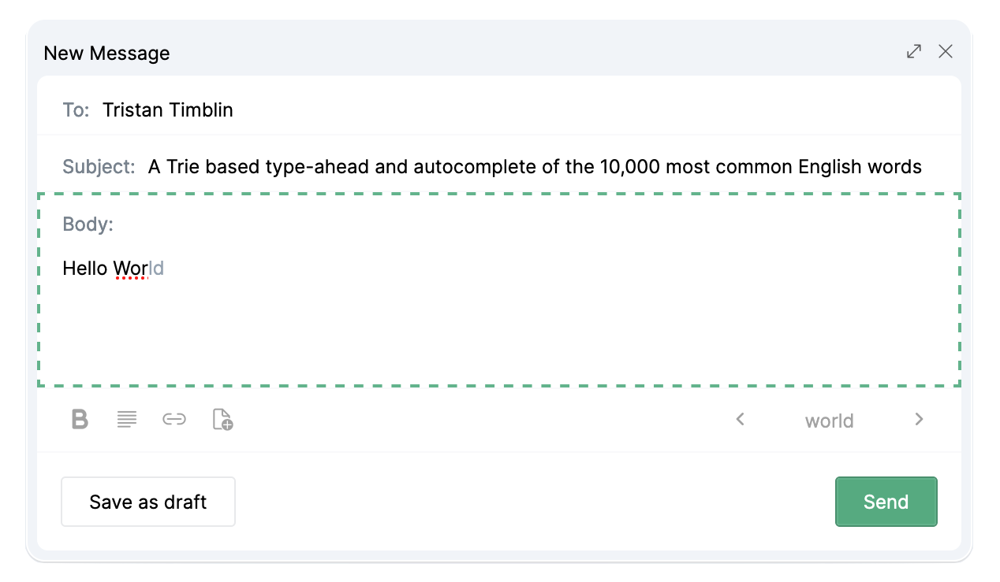

# trie-autocomplete

    

[Try it live](https://tatimblin.github.io/trie-autocomplete/)

An implementation of a suggest-as-you-go typing experience found in many WYSIWYG editors. The words are stored in a Trie, a tree based data-structure which optimizes the search by ignoring non-matching words.

## usage

1. The Body is the only field with this functionality enabled.
2. Begin typing to see suggestions for the remainder of word in light grey.
3. Use `Tab`, click the light grey suggestion, or click the complete word on the bottom right to approve a suggestion.
4. Use `PageUp`/`PageDown` or the Left/Right arrows in the bottom right to cycle through available suggestions.

## data-structures

Part of the [front-end data-structures collection](https://github.com/tatimblin/data-structures), a series of isolated examples that illustrate  computer science fundamentals in front-end development.